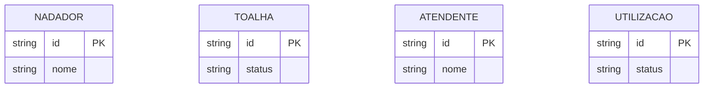
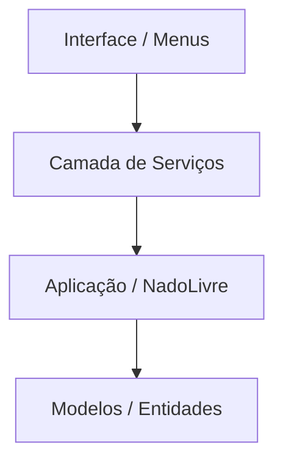

# Sistema Nado Livre

**Turma:** InfoWeb 2V

**Equipe:**
* Henzo Nunes Dias Soares
* Paulo Victor Leite Leão
* Ryann Richard Soares Silva

---

## 📌 Apresentação do Sistema

O controle manual de toalhas na escola de natação dificultava o rastreio de empréstimos, causando perda de toalhas e desorganização. Por isso foi desenvolvido um sistema para gerenciar e rastrear todo o ciclo de vida das toalhas (cadastro, retirada e devolução). Onde o sistema é operado pelos atendentes da escola nos balcões de atendimento, registrando as interações dos nadadores. Focando no cadastro de usuários e toalhas, controle de disponibilidade em tempo real e histórico de utilizações.

---

## 🗄️ Modelo Lógico do Banco de Dados

Diagrama de Entidade-Relacionamento que representa a estrutura de dados do sistema.

## 📐 Documentação da Arquitetura

Após as novas alterações da segunda versão, abaixo temos a mostra da nova camada de serviços e a hierarquia do sistema:

